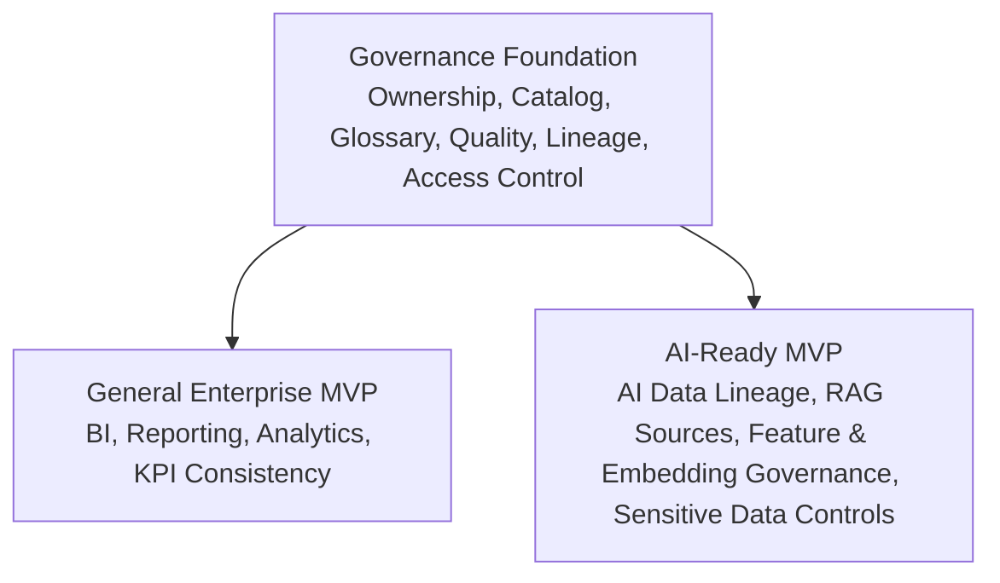

# Data Governance Playbook

This repository provides practical MVP reference models for implementing data governance in modern enterprises.

The goal is not to build a heavy governance framework. The goal is to help organizations establish a minimum viable governance capability that can be adopted, tested, and improved quickly.

---

## TL;DR

| Item             | Description                                                                                                                                |
| ---------------- | ------------------------------------------------------------------------------------------------------------------------------------------ |
| Intended readers | CDO, Head of Data Platform, Data Governance Lead, Analytics Lead, AI Platform Lead                                                         |
| Best for         | Teams that want a lightweight, execution-oriented data governance MVP                                                                      |
| Not for          | Readers looking for a full DAMA-DMBOK implementation manual, vendor-specific tool configuration, or industry-specific compliance framework |
| Reading time     | About 5–7 minutes                                                                                                                          |

---

## About This Repository

Data governance requirements vary significantly across organizations.

A general enterprise data governance program and an AI-ready data governance program may share the same foundation, but they have different priorities, risks, and implementation paths.

This repository provides two MVP reference versions to help organizations move from governance concepts to practical implementation:

1. General Enterprise Data Governance MVP
2. AI-Ready Data Governance MVP

The MVP approach is intentionally lightweight. It focuses on the minimum set of governance capabilities required to create business value, improve trust, and reduce risk.

---

## Relationship with Existing Frameworks

This playbook is framework-agnostic.

It draws on concepts from DAMA-DMBOK, DCAM, data product thinking, and modern data platform practices, but it is intentionally lighter and more execution-oriented.

It is not intended to replace established data management frameworks. Instead, it provides a practical MVP layer that helps teams move from governance principles to implementation.

---

## What is Data Governance?

Data governance is the operating framework that defines how data is managed, owned, understood, trusted, protected, and used across an organization.

It typically includes:

* Data ownership and accountability
* Data catalog and metadata management
* Business glossary and data definitions
* Data quality management
* Data lineage and impact analysis
* Data access control and security
* Data lifecycle management
* Governance operating model and decision rights

Data governance is not only a technology implementation. It is a combination of people, process, technology, and operating model.

A practical data governance program should help an organization answer questions such as:

* What data do we have?
* Where is the data located?
* Who owns the data?
* What does the data mean?
* Can the data be trusted?
* Who can access the data?
* How is the data used across reporting, analytics, applications, and AI systems?

---

## Why Data Governance Matters

Modern organizations depend on data for decision-making, reporting, analytics, product development, compliance, automation, and AI adoption.

Without effective data governance, organizations often face recurring problems:

* Business users do not trust reports or dashboards.
* Different teams use different definitions for the same metric.
* Critical data assets are difficult to discover.
* Data quality issues are found too late.
* Data ownership is unclear.
* Sensitive data is accessed or used without proper controls.
* Data lineage is missing, making impact analysis difficult.
* AI and analytics use cases are blocked by unreliable or poorly governed data.

For traditional analytics, data governance improves the reliability of reporting, metrics, and business decision-making.

For AI, data governance becomes even more important because AI systems can amplify existing data problems. Poor data quality, unclear data definitions, missing lineage, and weak access control can directly affect model outputs, retrieval quality, compliance posture, and business trust.

---

## Why Data Governance is Difficult

Data governance is difficult because it requires changes across teams, systems, processes, and behaviors.

Common implementation challenges include:

| Challenge                   | Description                                                                                                                   |
| --------------------------- | ----------------------------------------------------------------------------------------------------------------------------- |
| Unclear ownership           | Data often flows across multiple teams, platforms, and business domains, making ownership hard to define.                     |
| Inconsistent definitions    | The same business term or metric may have different meanings across departments.                                              |
| Fragmented systems          | Enterprise data may exist across warehouses, lakes, SaaS platforms, BI tools, spreadsheets, and operational systems.          |
| Tool-first implementation   | Data catalog, quality, and lineage tools do not create governance by themselves. They require roles, processes, and adoption. |
| Heavy governance process    | Overly complex governance processes can slow down business teams and reduce adoption.                                         |
| Limited business engagement | Governance cannot succeed if it is treated only as an IT or data platform responsibility.                                     |
| AI-readiness pressure       | AI use cases require stronger controls around trusted data, lineage, access, privacy, and semantic consistency.               |

A practical data governance program should start small, focus on high-value data domains, and establish repeatable patterns before scaling.

---

## Common Anti-patterns

| Anti-pattern                                    | Why It Fails                                                                     |
| ----------------------------------------------- | -------------------------------------------------------------------------------- |
| Buying a catalog tool before defining ownership | Tools cannot create accountability by themselves.                                |
| Trying to govern every data asset at once       | Governance becomes too broad, slow, and hard to adopt.                           |
| Treating governance as an IT-only initiative    | Business definitions, ownership, and priorities require business participation.  |
| Creating policies without operational workflows | Governance principles do not work unless they are embedded into daily processes. |
| Measuring governance by documentation volume    | More documentation does not necessarily mean better trust, quality, or adoption. |

---

## Governance Scenarios

There is no single governance model that fits every organization.

A company that mainly needs trusted reporting and analytics may need a different MVP from a company that is actively building machine learning, generative AI, RAG, or agentic AI capabilities.

This repository separates data governance MVPs into two initial scenarios.

---

## Scenario 1: General Enterprise Data Governance

The General Enterprise Data Governance MVP is designed for organizations that need a practical foundation for trusted enterprise data usage.

This scenario is suitable for:

* Enterprise reporting and BI teams
* Data platform teams
* Analytics teams
* Data warehouse or data lake programs
* Organizations with recurring data quality and metric definition issues
* Organizations starting a formal governance initiative

Core focus areas:

* Critical data asset identification
* Data ownership model
* Business glossary
* Data catalog
* Data quality rules
* Metric and KPI definitions
* Basic data lineage
* Data classification, access control, and privacy
* Data lifecycle and retention
* Governance roles and operating cadence

Objective:

> Establish a lightweight but functional governance foundation that improves trust, accountability, and consistency across enterprise data usage.

---

## Scenario 2: AI-Ready Data Governance

The AI-Ready Data Governance MVP is designed for organizations that are adopting AI, machine learning, generative AI, RAG, or agent-based systems.

This scenario is suitable for:

* AI and machine learning teams
* Data science teams
* GenAI platform teams
* Organizations building RAG applications
* Organizations using enterprise data in LLM-based systems
* Organizations that need stronger controls for AI data usage

Core focus areas:

* Trusted data sources for AI
* Data quality requirements for AI use cases
* Data catalog for AI-consumable assets
* Data lineage for model inputs, features, prompts, embeddings, and outputs
* Sensitive data classification, privacy, and lifecycle controls
* Access governance for AI systems
* Semantic consistency across business terms and AI applications
* Human review and approval workflows for high-risk data usage
* Monitoring of data issues that may affect AI behavior

Objective:

> Ensure that AI systems are built on governed, traceable, reliable, and secure data foundations.

---

## MVP Reference Versions

This repository currently provides two MVP reference versions:

| MVP Version                            | Purpose                                                                                                    | Target Scenario                         |
| -------------------------------------- | ---------------------------------------------------------------------------------------------------------- | --------------------------------------- |
| General Enterprise Data Governance MVP | Establish a minimum viable governance foundation for enterprise reporting, analytics, and data management. | General enterprise data governance      |
| AI-Ready Data Governance MVP           | Establish a minimum viable governance foundation for AI, ML, GenAI, RAG, and agentic AI use cases.         | AI-ready or AI-enabled organizations    |

---

## Capability Overview

The two MVP versions share a common governance foundation. The AI-ready version extends this foundation with additional controls for AI data usage, traceability, and risk management.



---

## Recommended Repository Structure

```text
data-governance-playbook/
├── README.md
├── mvps/
│   ├── general-enterprise-mvp.md
│   └── ai-ready-mvp.md
├── concepts/
│   ├── what-is-data-governance.md
│   ├── governance-capability-matrix.md
│   ├── data-classification.md
│   ├── data-privacy.md
│   ├── data-lifecycle.md
│   ├── data-quality.md
│   ├── data-catalog.md
│   ├── data-lineage.md
│   ├── data-ownership.md
│   ├── business-glossary.md
│   └── data-access-control.md
├── operating-model/
│   ├── roles-and-responsibilities.md
│   ├── governance-forum.md
│   ├── decision-rights.md
│   ├── issue-management.md
│   ├── access-review-cadence.md
│   ├── kpi-library.md
│   ├── raci.md
│   └── reconciliation-and-recovery.md
├── anti-patterns/
│   ├── common-governance-anti-patterns.md
│   └── publishing-checklist.md
└── templates/
    ├── data-domain-template.md
    ├── data-product-template.md
    ├── data-quality-rule-template.md
    ├── glossary-template.md
    ├── data-lineage-template.md
    ├── access-request-template.md
    └── data-issue-template.md
```

---

## How to Use This Repository

Start with the MVP that best matches your current business scenario.

Use the General Enterprise Data Governance MVP if your main priorities are:

* Improving trust in reporting and analytics
* Standardizing business definitions
* Defining data ownership
* Managing data quality issues
* Building a data catalog
* Establishing basic governance processes

Use the AI-Ready Data Governance MVP if your main priorities are:

* Preparing enterprise data for AI use cases
* Supporting machine learning or GenAI initiatives
* Governing RAG data sources
* Managing AI-related data risk
* Tracking data lineage for AI inputs and outputs
* Ensuring sensitive data is properly controlled before AI consumption

---

## Current Scope

The initial scope of this repository focuses on MVP-level implementation guidance.

In scope:

* Practical data governance MVP design
* General enterprise governance foundation
* AI-ready data governance foundation
* Lightweight operating model
* Reusable templates
* Common governance anti-patterns
* Governance capability overview

Out of scope for the initial version:

* Full-scale enterprise data governance maturity model
* Complete regulatory compliance framework
* Vendor-specific implementation guide
* Detailed platform configuration for specific tools
* Industry-specific governance frameworks
* Advanced AI model governance
* Full data management operating model across all enterprise domains

---

## Beyond This MVP

Some organizations will eventually outgrow this MVP. What usually comes next is heavier: coordinated domain-by-domain standards, a dedicated catalog and lineage platform, formal enterprise policy documents, and dedicated governance tooling.

This repository intentionally stops before that layer. If a program reaches that point, the artifacts here should be the foundation that heavier work builds on — not something to replace with a bigger framework before the MVP itself is actually working.
