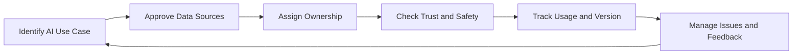

# AI-Ready Data Governance MVP

This playbook describes a lightweight MVP for AI-ready data governance.

It is written for organizations that are starting to use enterprise data in AI, machine learning, GenAI, RAG, or agent-based applications.

The goal is not to build a full AI governance framework. The goal is simpler:

> Know which data can be used for AI, who owns it, whether it is safe and trusted, where it is used, which version was used, and what happens when something goes wrong or needs improvement.

This MVP focuses on the data side of AI readiness. It does not cover the full model lifecycle, AI ethics program, model risk management, or vendor-specific platform setup.

---

## 1. Purpose

The AI-Ready Data Governance MVP helps an organization answer seven practical questions:

1. Which data sources are approved for AI use?
2. Who owns those data sources?
3. What do the data sources mean?
4. Can the data be trusted for this AI use case?
5. Is the data safe to use in this AI context?
6. Which version or snapshot of the data was used?
7. What happens when AI output is wrong, outdated, unclear, or not useful?

If these questions cannot be answered, the organization is not ready to scale AI safely.

This MVP should be applied first to high-value or high-risk AI use cases, not every AI experiment.

---

## 2. When to Use This MVP

Use this MVP when the organization is building or operating:

* GenAI applications
* RAG applications
* Internal knowledge assistants
* Customer support AI
* Document search and summarization
* Machine learning models
* AI agents that use enterprise data
* AI-enabled reporting or decision support

It is especially useful when:

* Teams are using enterprise data in AI without clear approval.
* RAG applications retrieve outdated or low-quality content.
* Sensitive data may be exposed to AI tools.
* Nobody knows which source was used to generate an AI answer.
* Different AI teams use different versions of the same data.
* Business users do not trust AI outputs.
* User feedback is collected but does not reach the people who own the source data.
* Data owners are not involved in AI data usage decisions.

---

## 3. Core Principle

The core principle is:

> AI should use data that is owned, understood, trusted, allowed, and traceable for the intended use.

AI does not remove the need for data governance. It makes the gaps more visible.

Bad data can create bad reports. In AI systems, bad data can also create misleading answers, poor retrieval results, privacy exposure, compliance concerns, or business decisions based on the wrong context.

Start with data that carries the most AI value or AI risk.

Good MVP candidates include data sources that are:

* Used by a production AI application
* Used in a RAG knowledge base
* Used to train, evaluate, or support a model
* Used to generate customer-facing responses
* Used to support business decisions
* Sensitive, confidential, regulated, or commercially important
* Shared across multiple AI applications or teams
* Known to have quality, freshness, versioning, or ownership issues

The MVP should stay small. It is better to govern a few important AI data sources properly than to create broad AI governance documentation that nobody uses.

---

## 4. Minimum AI Data Governance Loop

The MVP is built around a simple loop.

This loop matters more than the tool used to support it.

A catalog, vector database, feature store, ticketing system, wiki, or AI platform can help. But the governance loop should work even before the organization has mature tooling.

---

## 5. AI Use Case Scope

Start by deciding which AI use cases are in scope.

Do not start by governing every experiment. Start with AI use cases that are business-facing, widely used, sensitive, or likely to influence decisions.

Examples:

* Internal knowledge assistant used by many employees
* Customer support assistant
* RAG application for policy or procedure search
* AI assistant for sales, finance, legal, HR, or operations
* Model using customer, transaction, product, or financial data
* Agent that retrieves, transforms, or sends enterprise data

### Minimum Output

Create a simple AI use case register.

| Field             | Description                                                                           |
| ----------------- | ------------------------------------------------------------------------------------- |
| AI use case       | Name of the AI application, model, assistant, or workflow                             |
| Business owner    | Team or person accountable for the use case                                           |
| Main users        | Who uses the AI output                                                                |
| Data sources used | Key datasets, documents, systems, or knowledge bases                                  |
| Business impact   | What decisions or processes the AI supports                                           |
| Risk level        | Low, medium, high, or critical                                                        |
| Current concern   | Trust, sensitivity, freshness, ownership, access, output quality, or versioning issue |

### Rule of Thumb

If an AI use case affects customers, employees, financial decisions, regulated processes, or executive decisions, it should not rely on unmanaged data sources.

---

## 6. Governance Trigger Events

AI data governance should be triggered by real events, not only by scheduled reviews.

| Trigger Event                                     | Governance Action                                                                             |
| ------------------------------------------------- | --------------------------------------------------------------------------------------------- |
| A new AI use case moves beyond experimentation    | Identify owner, data sources, intended use, and risk level                                    |
| A new data source is added to a RAG application   | Review ownership, freshness, sensitivity, trust status, and approved usage                    |
| A model starts using a new dataset or feature     | Confirm owner, definition, quality expectations, access permission, and versioning approach   |
| AI output is used in a business process           | Check whether the input data is suitable for the decision being supported                     |
| A sensitive dataset is requested for AI use       | Review classification, access, masking, retention, and allowed purpose                        |
| A source document, policy, or dataset changes     | Refresh affected knowledge bases or snapshots and notify impacted AI use cases                |
| Users report incorrect or misleading AI answers   | Investigate source data, retrieval quality, data version, prompt context, and output handling |
| Users repeatedly downvote or flag similar answers | Review source quality, missing content, outdated definitions, or unclear usage guidance       |

### Rule of Thumb

If adding a new data source to an AI system does not trigger any review, the organization does not yet have AI-ready data governance.

---

## 7. Approved AI Data Sources

AI systems should not consume enterprise data just because the data is technically available.

For the MVP, create a short list of data sources approved for specific AI use cases.

Approved data sources may include:

* Curated datasets
* Certified reports
* Policy documents
* Knowledge articles
* Product documentation
* Customer support content
* Feature tables
* Master data
* Controlled document repositories
* Approved APIs

A data source does not need to be perfect before it can be used. But its owner, purpose, limitations, sensitivity, trust status, and versioning approach should be clear.

### Minimum Output

Create an approved AI data source list.

| Field                        | Description                                                         |
| ---------------------------- | ------------------------------------------------------------------- |
| Data source                  | Dataset, document repository, API, feature table, or knowledge base |
| Approved AI use case         | Where this source is allowed to be used                             |
| Owner                        | Accountable business or data owner                                  |
| Source type                  | Structured data, document, API, feature, embedding, etc.            |
| Freshness expectation        | How current the data needs to be                                    |
| Version or snapshot approach | How the used version is identified or preserved                     |
| Sensitivity                  | Public, internal, confidential, or restricted                       |
| Trust status                 | Green, amber, or red                                                |
| Usage limitations            | Where the data should not be used                                   |

### Rule of Thumb

“The data is available” is not the same as “the data is appropriate for this AI use case.”

---

## 8. Ownership

Every AI-consumed data source needs clear ownership.

At minimum, each AI use case should have:

| Role              | Responsibility                                                                                      |
| ----------------- | --------------------------------------------------------------------------------------------------- |
| AI Use Case Owner | Accountable for the business purpose and acceptable use of the AI application                       |
| Data Owner        | Accountable for the meaning, quality expectations, and approved use of the data                     |
| Data Steward      | Maintains definitions, metadata, quality checks, usage notes, and feedback follow-up                |
| Technical Owner   | Maintains pipelines, integrations, indexes, embeddings, APIs, snapshots, or platform implementation |
| Risk Partner      | Advises on privacy, security, legal, compliance, or operational risk where needed                   |

The data owner should not be bypassed because the AI team can technically access the data.

AI data usage creates business risk. Ownership should sit close to the business process, customer journey, operational function, or decision area affected by the AI use case.

### Minimum Output

Create a simple AI data ownership register.

| AI use case | Data source | AI use case owner | Data owner | Data steward | Technical owner | Risk partner if needed |
| ----------- | ----------- | ----------------- | ---------- | ------------ | --------------- | ---------------------- |

### Rule of Thumb

If the AI team owns the model but nobody owns the source data, the AI use case is not properly governed.

---

## 9. Trust, Sensitivity, and Usage Rules

For each AI-consumed data source, define whether it is trusted and safe enough for the intended AI use.

The review should cover:

* What the data represents
* Where it comes from
* Who owns it
* How fresh it should be
* Whether it is complete enough
* Whether it contains sensitive data
* Whether it is suitable for this AI use case
* Whether human review is needed
* What limitations users should know

### Trust Status

Use a simple red / amber / green status.

| Status | Meaning                              | Typical Action                                                                 |
| ------ | ------------------------------------ | ------------------------------------------------------------------------------ |
| Green  | Approved for the defined AI use case | Use as a preferred AI data source                                              |
| Amber  | Usable with known limitations        | Use with caution, add user guidance or human review                            |
| Red    | Not approved for AI use              | Do not use until ownership, quality, sensitivity, or usage issues are resolved |

Trust status should be specific to the AI use case.

A data source may be green for internal search, amber for decision support, and red for customer-facing generation.

### Sensitivity Check

Every AI data source should have a basic sensitivity classification.

| Classification | Meaning                                               |
| -------------- | ----------------------------------------------------- |
| Public         | Approved for public use                               |
| Internal       | Available within the organization                     |
| Confidential   | Business-sensitive data requiring controlled access   |
| Restricted     | Highly sensitive data requiring strict access control |

### Minimum Output

Create a simple AI data source profile.

| Field                 | Description                                                  |
| --------------------- | ------------------------------------------------------------ |
| Data source           | Dataset, document set, API, feature table, or knowledge base |
| Business description  | What the source represents                                   |
| Owner                 | Accountable data owner                                       |
| Approved AI use case  | Where this source may be used                                |
| Freshness expectation | How current the data needs to be                             |
| Quality expectations  | Minimum checks or conditions                                 |
| Sensitivity           | Public, internal, confidential, or restricted                |
| Trust status          | Green, amber, or red                                         |
| Human review required | Yes or no, and when                                          |
| Known limitations     | Important caveats                                            |

### Rule of Thumb

If users would not be allowed to access the source data directly, they should not be allowed to access it through an AI system unless a specific control decision has been made.

---

## 10. AI Data Usage, Lineage, and Version

AI data lineage does not need to capture every technical detail at the MVP stage.

It should answer three practical questions:

1. Which data sources influenced this AI use case?
2. Which version, snapshot, or refresh timestamp was used?
3. Who or what process may be affected if the data changes?

For the MVP, lineage should show:

* Source data or documents
* Data version, snapshot ID, document version, or refresh timestamp
* Data preparation or filtering steps
* Knowledge base, feature table, index, or embedding store
* AI application, model, or agent using the data
* Main downstream users or business processes
* Known refresh or update path

This is especially important for ML and RAG.

For ML, a model may behave differently because the training, evaluation, or feature data changed.

For RAG, an answer may change because the document set, chunking, index, embedding model, retrieval configuration, or refresh timestamp changed.

The MVP does not need a complex version control platform from day one. It does need a practical way to know which data version was used when behavior changes.

### Minimum Output

Create a simple AI data lineage map.

| AI use case | Source data | Version or timestamp | Preparation step | AI data layer | AI application | Users or process |
| ----------- | ----------- | -------------------- | ---------------- | ------------- | -------------- | ---------------- |

Examples of AI data layers:

* Vector index
* Knowledge base
* Feature table
* Prompt context
* Retrieval API
* Document store
* Curated dataset
* Evaluation dataset
* Training snapshot

### Rule of Thumb

When an AI answer or model behavior changes, the team should be able to compare the current data version with the previous one.

---

## 11. Issue and Feedback Management

AI issues should not be investigated only as model problems.

Many AI issues are data issues. Some are not even “incidents” at first; they appear as weak signals in user feedback.

Examples:

* The AI answer is based on outdated documents.
* The wrong source was retrieved.
* Sensitive content appeared in the response.
* The model used the wrong definition of a metric.
* A knowledge base contains duplicate or conflicting documents.
* A source system changed but the AI index was not refreshed.
* Users lost trust because answers were inconsistent.
* Many users downvote answers related to the same topic.
* Users repeatedly ask follow-up questions because the source content is incomplete or unclear.

This MVP should support two paths:

1. **Issue path**: used when something is wrong and needs remediation.
2. **Feedback path**: used when user signals suggest that the data source, definition, or content can be improved.

### Issue Workflow

1. Log the issue.
2. Identify the affected AI use case.
3. Identify the affected data source or knowledge base.
4. Check the data version, snapshot, or refresh timestamp.
5. Assign an owner.
6. Assess business and user impact.
7. Check source data, freshness, sensitivity, retrieval, and usage context.
8. Agree on remediation or workaround.
9. Communicate status to affected users or business owners.
10. Apply the fix.
11. Confirm that the AI use case can be trusted again.
12. Update trust status, usage guidance, source approval, or review rules if needed.
13. Track recurrence.

### Feedback Workflow

1. Collect feedback signals such as thumbs up, thumbs down, user comments, repeated rephrasing, escalation, or manual correction.
2. Group feedback by AI use case, topic, source document, dataset, or business term.
3. Identify whether the feedback points to a data issue, definition issue, missing content, unclear content, outdated source, retrieval issue, or user guidance issue.
4. Send relevant feedback to the data owner, content owner, or steward.
5. Agree whether the source data, document, definition, metadata, or usage guidance should be updated.
6. Apply the update if needed.
7. Refresh the affected knowledge base, index, feature table, or approved data source.
8. Track whether similar feedback decreases after the change.

### Minimum Output

Create a simple AI data issue and feedback log.

| Item | Type | AI use case | Data source | Version or timestamp | Impact or signal | Owner | Status | Action taken | Trust restored or improved |
| ---- | ---- | ----------- | ----------- | -------------------- | ---------------- | ----- | ------ | ------------ | -------------------------- |

### Rule of Thumb

If users provide feedback but the signal never reaches data owners or content owners, the AI system may improve at the interface layer while the source problem remains unchanged.

---

## 12. Minimum Standard and Success Signals

A data source is minimally ready for AI use when:

* It is linked to an approved AI use case.
* It has a named data owner.
* Its business meaning is documented.
* Its source is known.
* Its freshness expectation is clear.
* Its minimum quality expectations are documented.
* Its sensitivity level is identified.
* Its approved AI usage is clear.
* Its usage limitations are visible.
* Its trust status is visible.
* Human review requirements are defined where needed.
* Its version, snapshot, or refresh timestamp can be identified.
* Its flow into the AI system is known at a practical level.
* Issues and feedback can be reported, assigned, communicated, and closed.

The MVP is working when:

* Teams know which data sources are approved for AI use.
* AI use cases have clear business owners.
* AI-consumed data sources have clear data owners.
* Sensitive data usage is reviewed before AI consumption.
* RAG data sources have owners, freshness expectations, known limitations, and version history.
* Users can see whether a data source is trusted, limited, or not approved.
* Data-related AI issues have named owners.
* User feedback can be routed back to the right data or content owner.
* Teams can investigate whether an AI issue came from source data, data version, retrieval, model behavior, or usage context.
* The same governance pattern can be reused for another AI use case.

Avoid measuring success by the number of AI policies, indexed documents, or governance meetings.

Measure it by trust, clarity, safe reuse, issue resolution, and whether user feedback leads to better governed data.

Once the MVP is working, expand gradually by adding more AI use cases, more approved data sources, stronger lineage, retrieval quality checks, access reviews, and closer links to model governance, privacy, risk, and compliance processes.
