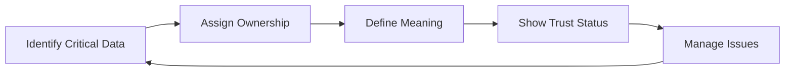

# General Enterprise Data Governance MVP

This playbook describes a lightweight MVP for general enterprise data governance.

It is written for organizations that want to improve trust, ownership, consistency, and issue handling around important enterprise data, without starting with a heavy governance framework.

The goal is simple:

> Govern the data that matters most, make ownership clear, define what the data means, show whether it can be trusted, and create a practical way to handle problems.

This MVP should be treated as a repeatable operating pattern, not as a large transformation program.

---

## 1. Purpose

The General Enterprise Data Governance MVP helps an organization answer five basic questions:

1. Which data assets matter most?
2. Who owns them?
3. What do they mean?
4. Can people trust them?
5. What happens when something is wrong?

If these questions cannot be answered for critical reports, metrics, or datasets, the organization does not yet have a working governance foundation.

This MVP does not try to govern every table, field, dashboard, or system. It focuses on a small number of important data assets first, then builds a pattern that can be reused.

---

## 2. When to Use This MVP

Use this MVP when the organization has issues such as:

* Business users do not trust key reports or dashboards.
* Different teams define the same metric differently.
* Nobody is clearly accountable for important data.
* Data quality issues are handled case by case.
* Teams are unsure which dataset is the official one.
* Access decisions depend on informal approval.
* Reports depend on data that few people understand.
* Audit, legal, regulatory, or compliance data is not clearly owned or controlled.

This MVP is suitable for enterprise reporting, BI, analytics, shared data platforms, and core business data domains.

---

## 3. What This MVP Covers

This MVP covers the minimum governance practices needed for critical enterprise data:

| Area                 | What It Means                                        |
| -------------------- | ---------------------------------------------------- |
| Critical data scope  | Decide which data assets should be governed first    |
| Ownership            | Assign clear accountability                          |
| Business definitions | Define key terms and metrics                         |
| Trust standards      | Show whether data is usable, limited, or not trusted |
| Issue management     | Handle data problems in a consistent way             |
| Trigger events       | Connect governance actions to real business events   |

This MVP does not cover everything in enterprise data management. Topics such as full data lifecycle management, detailed technical lineage, advanced privacy programs, domain scorecards, and platform automation can be added later.

---

## 4. Core Principle

The core principle is:

> Start with the data that carries the most business value or business risk.

Do not begin by trying to catalog the whole enterprise.

Start with a small set of data assets where governance will make a visible difference.

A good MVP candidate is usually one or more of the following:

* Used in executive reporting
* Used by multiple teams
* Connected to important business KPIs
* Frequently questioned or disputed
* A known source of data quality issues
* Sensitive or business-critical
* Required for operational or financial decisions
* Required for audit, legal, regulatory, or compliance purposes

Compliance-driven data should be treated as high priority. If a dataset supports audit, legal, regulatory, or statutory reporting, weak ownership and unclear definitions can create real business risk.

The MVP should be small enough to maintain, but strong enough to build trust.

---

## 5. Minimum Governance Loop

The MVP is built around a simple loop.

This loop matters more than the tool used to support it.

A catalog, glossary, data quality tool, ticketing system, or wiki can all help. But the governance loop should work even before the organization has mature tooling.

---

## 6. Critical Data Scope

The first step is to decide what is in scope.

The MVP should focus on a short list of critical data assets, such as:

* Executive dashboards
* Key business metrics
* Customer data
* Product data
* Revenue data
* Financial reporting data
* Operational performance data
* Shared analytics datasets
* Data used for audit, legal, regulatory, or compliance reporting

The scope should be intentionally small. It is better to govern 10 important assets well than to document 500 assets nobody maintains.

### Minimum Output

Create a simple critical data asset list.

| Field                | Description                                            |
| -------------------- | ------------------------------------------------------ |
| Data asset           | Dataset, report, dashboard, metric, or data product    |
| Business domain      | The business area it belongs to                        |
| Reason for inclusion | Why this asset matters                                 |
| Main consumers       | Teams or users who rely on it                          |
| Current pain point   | Trust, quality, ownership, access, or definition issue |
| Risk level           | Business, compliance, operational, or financial risk   |

### Rule of Thumb

If nobody can explain why an asset is critical, it should not be in the MVP scope.

---

## 7. Governance Trigger Events

Governance should not depend only on scheduled meetings. It should be triggered by real business and data events.

The following events should trigger a governance action:

| Trigger Event                                                          | Governance Action                                                                     |
| ---------------------------------------------------------------------- | ------------------------------------------------------------------------------------- |
| A new executive dashboard is created                                   | Confirm owner, metric definitions, source data, trust status, and issue path          |
| A new critical metric is introduced                                    | Define business meaning, calculation logic, owner, and approved usage                 |
| A dataset starts being reused by multiple teams                        | Add it to the critical data list and assign ownership                                 |
| A recurring data quality issue appears                                 | Define quality expectations, issue owner, and remediation path                        |
| A sensitive dataset is requested for broader access                    | Review classification, access owner, approved purpose, and restrictions               |
| A source system or data pipeline changes                               | Review impact on downstream reports, metrics, and consumers                           |
| A dataset is used for audit, legal, regulatory, or compliance purposes | Confirm ownership, definition, quality expectations, access control, and traceability |

### Rule of Thumb

Governance should follow business activity. If new reports, metrics, access requests, and source changes do not trigger governance actions, governance will remain passive.

---

## 8. Ownership

Every critical data asset needs clear ownership.

At minimum, each asset should have three types of accountability:

| Role            | Responsibility                                                                               |
| --------------- | -------------------------------------------------------------------------------------------- |
| Data Owner      | Accountable for business meaning, quality expectations, access decisions, and prioritization |
| Data Steward    | Maintains definitions, metadata, quality checks, and issue follow-up                         |
| Technical Owner | Maintains pipelines, platforms, tables, reports, and technical implementation                |

The data owner should usually come from the business domain, not only from IT or data engineering.

Ownership should also align with existing business accountability. A good data owner is usually connected to the business process, KPI, function, or decision area that depends on the data.

Examples:

| Data Area                    | Likely Ownership Anchor                                                             |
| ---------------------------- | ----------------------------------------------------------------------------------- |
| Revenue data                 | Commercial, finance, or revenue operations accountability                           |
| Customer data                | Customer operations, customer lifecycle, CRM, or customer experience accountability |
| Product data                 | Product management, product operations, or product lifecycle accountability         |
| Financial reporting data     | Finance, control, or statutory reporting accountability                             |
| Operational performance data | The function accountable for the relevant operation                                 |

Ownership should not be assigned only because someone is technically close to the data. Technical familiarity helps, but business accountability is the key.

### Minimum Output

Create a simple ownership register.

| Data asset | Data owner | Data steward | Technical owner | Related KPI or process |
| ---------- | ---------- | ------------ | --------------- | ---------------------- |

### Rule of Thumb

A data asset without an owner is not governed.

A data owner without a link to business accountability is unlikely to be effective.

---

## 9. Business Definitions

Critical terms and metrics need shared meaning.

Start with the terms that are used often, disputed often, or important for decision-making.

Examples:

* Customer
* Active customer
* Revenue
* Net revenue
* Gross margin
* Order
* Churn
* Conversion rate
* Product
* Region

Do not try to define every column in every table. Start with terms and metrics that affect decisions.

### Minimum Output

Create a lightweight business glossary.

| Term or metric | Definition | Owner | Calculation logic | Approved usage |
| -------------- | ---------- | ----- | ----------------- | -------------- |

For metrics, the calculation logic matters as much as the definition. If two teams calculate the same metric differently, the difference should be visible and resolved.

### Rule of Thumb

A critical metric should have one approved definition, one owner, and one preferred usage.

---

## 10. Trust Standards

For each critical data asset, define the minimum conditions under which people can use it with confidence.

This does not require a large data quality program. The goal is to make trust visible.

A trust standard should cover:

* What the data represents
* Where the data comes from
* How fresh it should be
* Which fields are most important
* Which quality checks matter
* Whether the data is sensitive
* Where it should be used
* Where it should not be used
* Known limitations
* Current trust status

### Trust Status

Use a simple red / amber / green status.

| Status | Meaning                           | Typical Action                                                                    |
| ------ | --------------------------------- | --------------------------------------------------------------------------------- |
| Green  | Trusted for approved business use | Use as the preferred source for defined use cases                                 |
| Amber  | Usable with known limitations     | Use with caution; review limitations before relying on it                         |
| Red    | Not trusted for official use      | Do not use for official reporting or critical decisions until issues are resolved |

The trust status should be visible to data consumers. It should not live only in technical notes or private conversations.

### Minimum Output

Create a simple data asset profile.

| Field                | Description                                   |
| -------------------- | --------------------------------------------- |
| Data asset           | Name of the asset                             |
| Business description | What the asset represents                     |
| Source               | Main upstream source                          |
| Owner                | Accountable owner                             |
| Key fields           | Most important fields                         |
| Quality expectations | Minimum quality rules or checks               |
| Sensitivity          | Public, internal, confidential, or restricted |
| Trust status         | Green, amber, or red                          |
| Approved usage       | Where the asset should be used                |
| Known limitations    | Important caveats                             |

### Example Quality Expectations

* Customer ID should not be null.
* Revenue should not be negative unless transaction type is refund.
* Product code should exist in the product master.
* Data should be refreshed before business reporting starts.
* Executive KPI values should match the approved calculation logic.

### Rule of Thumb

Trust does not require perfect data. It requires clear expectations, known limitations, visible status, and accountable owners.

---

## 11. Issue Management

Data issues should not be handled only through informal messages.

A simple issue workflow is enough for the MVP, but it should be consistent.

Issues may include:

* Incorrect data
* Missing data
* Conflicting definitions
* Unclear ownership
* Broken reports
* Access disputes
* Outdated documentation
* Unexpected source system changes
* Loss of trust in a report, metric, or dataset

### Minimum Workflow

1. Log the issue.
2. Assign an owner.
3. Assess business impact.
4. Identify affected data assets and consumers.
5. Investigate root cause.
6. Agree on remediation or workaround.
7. Communicate the issue status to affected consumers.
8. Apply the fix or workaround.
9. Confirm that consumers can trust the data again.
10. Update the definition, quality rule, trust status, ownership, or usage guidance if needed.
11. Track recurrence.

The workflow should close the loop with consumers. Fixing the data is not enough if the users still do not know whether they can trust it.

### Minimum Output

Create a simple issue log.

| Issue | Data asset | Impact | Affected consumers | Owner | Status | Resolution | Trust restored |
| ----- | ---------- | ------ | ------------------ | ----- | ------ | ---------- | -------------- |

### Communication Expectations

For critical issues, affected consumers should be informed when:

* The issue is confirmed.
* The business impact is understood.
* A workaround is available.
* The issue is resolved.
* The data can be trusted again.

### Rule of Thumb

If issues are solved through informal messages only, governance is not yet operational.

If consumers are not told when trust is restored, the issue is not fully closed.

---

## 12. Minimum Artifacts

This MVP only needs a small set of artifacts.

| Artifact                 | Purpose                                                                              |
| ------------------------ | ------------------------------------------------------------------------------------ |
| Critical Data Asset List | Shows what is in governance scope                                                    |
| Ownership Register       | Shows who is accountable                                                             |
| Business Glossary        | Defines key terms and metrics                                                        |
| Data Asset Profile       | Captures meaning, source, quality expectations, sensitivity, usage, and trust status |
| Issue Log                | Tracks problems, owners, status, resolution, and trust recovery                      |

These can be maintained in a spreadsheet, wiki, catalog tool, ticketing system, or governance platform.

The format is less important than whether the information is owned, maintained, and used.

---

## 13. Minimum Standard for a Governed Data Asset

A data asset is minimally governed when:

* It is included in the critical data asset list.
* It has a named data owner.
* It has a named steward or responsible maintainer.
* Its business meaning is documented.
* Its key terms or metrics are defined.
* Its main source is known.
* Its minimum quality expectations are documented.
* Its sensitivity level is identified.
* Its trust status is visible.
* Its approved usage or known limitation is clear.
* Issues can be reported, assigned, communicated, and closed.

This is the minimum standard. It is not a full maturity model.

---

## 14. What to Avoid

Avoid turning the MVP into a large governance program too early.

| Anti-pattern                                     | Why to Avoid It                                            |
| ------------------------------------------------ | ---------------------------------------------------------- |
| Governing every dataset                          | The scope becomes too large and adoption slows down        |
| Buying tools before defining owners              | Tools cannot create accountability by themselves           |
| Creating a huge glossary                         | Too many definitions become hard to maintain               |
| Measuring success by documentation volume        | More documentation does not always create trust            |
| Treating governance as an IT-only task           | Business meaning and priorities require business ownership |
| Assigning owners without business accountability | Ownership becomes nominal and decisions do not stick       |
| Designing complex workflows                      | Heavy processes reduce adoption                            |
| Hiding trust status from consumers               | Users continue to rely on informal judgment                |

The MVP should stay practical. The point is not to create more governance artifacts. The point is to make important data easier to trust and easier to manage.

---

## 15. Success Signals

The MVP is working when:

* Business users know which data assets are trusted.
* Critical data assets have clear owners.
* Key metrics have approved definitions.
* Data quality issues have named owners.
* Teams know how to report data problems.
* Affected consumers are notified when important issues occur.
* Trust status is visible for critical data assets.
* Common data disputes are reduced.
* The same pattern can be reused for another data domain.
* The organization can explain why a data asset is trusted, limited, or not trusted.

Success should be measured by improved trust, clarity, and accountability, not by the number of documents created.

---

## 16. Expansion Path

Once the MVP is working, the organization can expand gradually.

Possible next steps:

* Add more critical data assets.
* Add more business domains.
* Improve catalog coverage.
* Automate metadata collection.
* Add more detailed lineage.
* Strengthen access review.
* Expand data quality monitoring.
* Create domain-level governance scorecards.
* Extend the model to AI-ready data governance.

Expansion should follow business value and adoption. Do not scale the governance model faster than the organization can maintain it.
